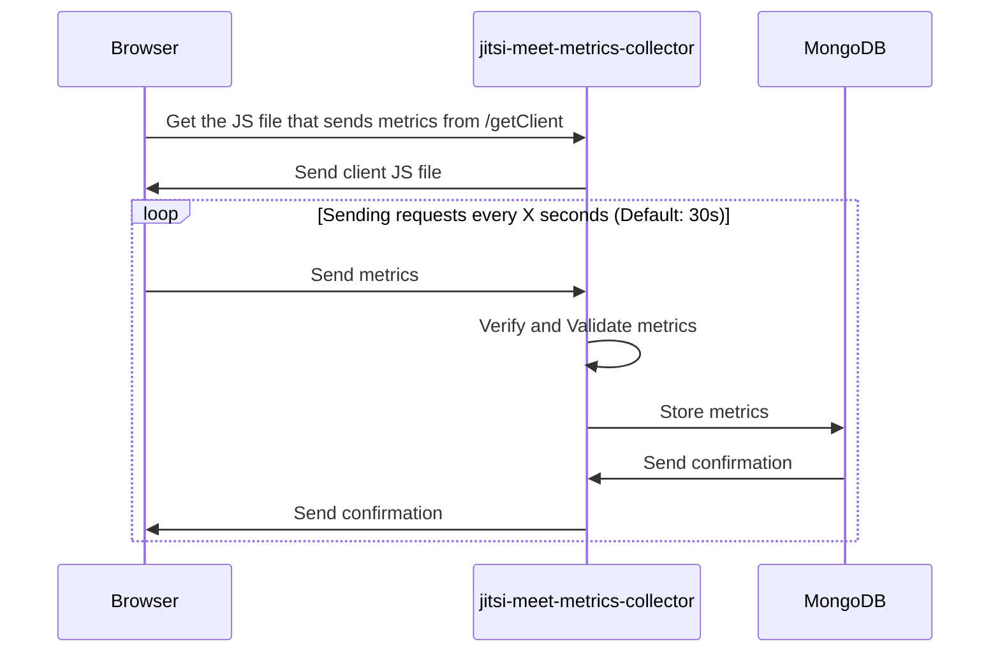

 :warning: **Warning** :warning:
**This module is currently expiremental. Please use caution when using it in production.**
# What is jitsi-meet-metrics-collector ?
jitsi-meet-metrics-collector is a Node.js module that serves as a middleware for Express.js. It collects browser metrics and stores them in MongoDB database.

# Using jitsi-meet-metrics-collector

In order to use jitsi-meet-metrics-collector, it needs to be imported into Express.js as follows : 

    var express = require('express');
    var app = express();
    var mongoose = require("mongoose")
    var jitsiMeetMetricsCollector = require("@apitech/jitsi-meet-metrics-collector");
    
    var config = {
        authorizedRegions : ["REGION1", "REGION2"]
    }
    
    app.use('/jitsi-meet-metrics-collector',jitsiMeetMetricsCollector({
        confPattern: new RegExp('^(?=(?:[a-zA-Z0-9]*[a-zA-Z]))(?=(?:[a-zA-Z0-9]*[0-9]){3})[a-zA-Z0-9]{10,}$'),
        mongoose : mongoose,
        authorizedRegions: config.authorizedRegions,
        jmmcCollection: 'metrics-collector'
    }));
    
    module.exports = app;

:warning:Documentation in progress...:warning:
